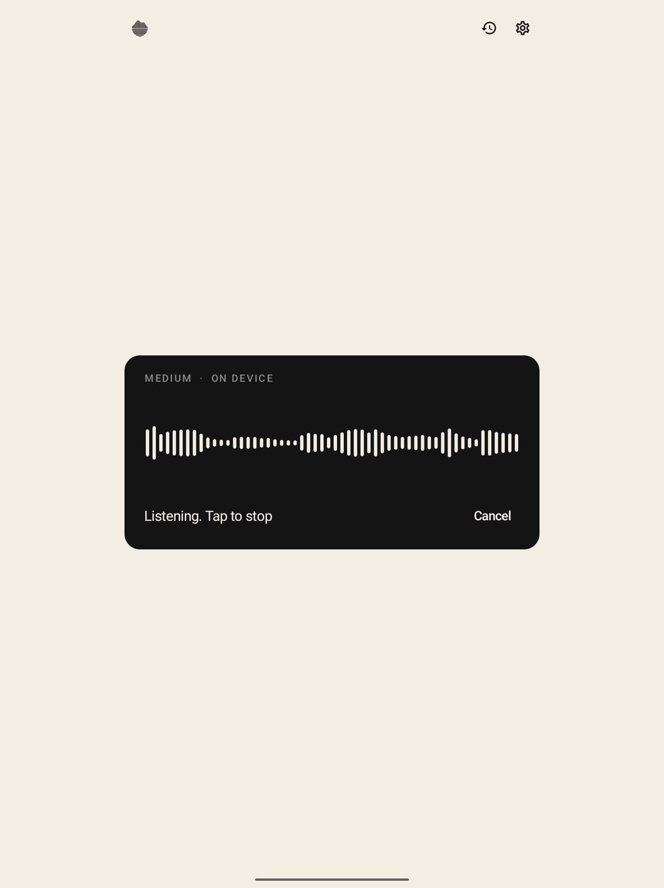
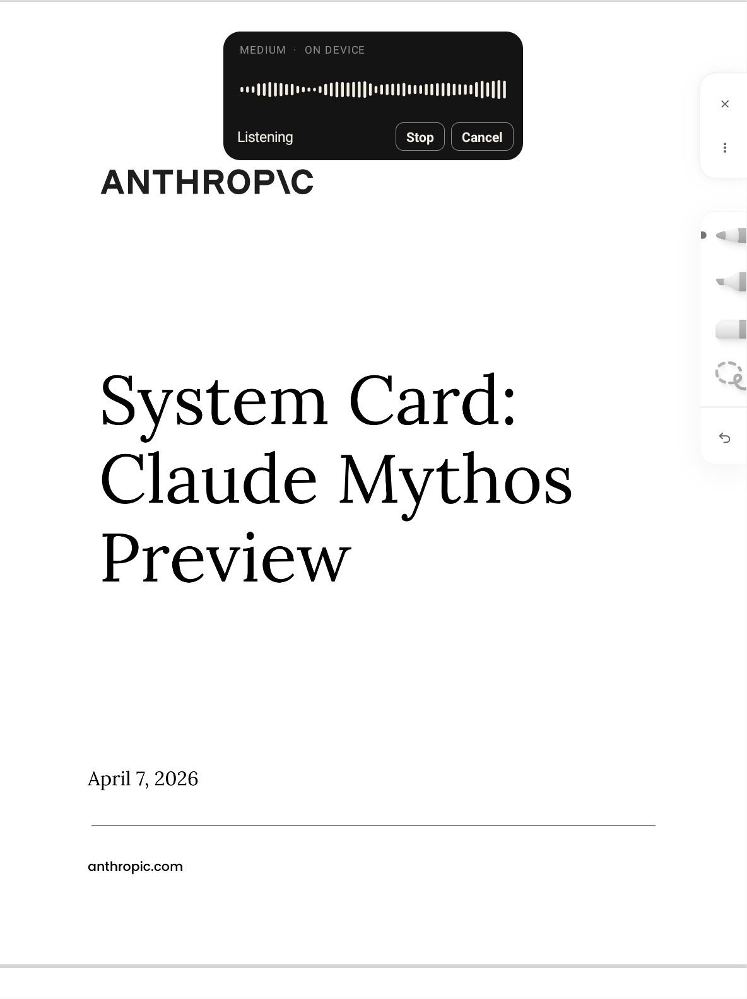

  

<h1 align="center">Daysay</h1>

  Calm, system-wide dictation for the Daylight DC-1.

Daysay turns speech into text without asking you to stop what you are doing. Dictation stays
active while you scroll, read, or move between apps. When the transcript is ready, Daysay puts it
in the focused text field and copies it to the clipboard.

The default models run on the DC-1 through whisper.cpp. Your recordings and transcripts can stay
on the tablet, with no Google speech service and no account. Remote transcription and an optional
cleanup pass are available if you choose to configure them.

## Why I built it

I could not find a dictation app made for the Daylight DC-1. Voice input in Gboard and similar apps
is tied to the keyboard experience. I wanted to keep reading, scroll through a document, and move
between apps while recording continued.

Daysay grew from that need. It treats dictation as a quiet system tool instead of a screen that
demands your attention.

## What it does

- Runs English and multilingual whisper.cpp models on the device.
- Continues listening while you use other apps.
- Shows a small floating panel without taking focus from your work.
- Delivers each transcript to the focused field and the clipboard.
- Keeps a local transcript history.
- Supports optional Groq, OpenAI, and OpenRouter transcription.
- Offers an optional cleanup pass for punctuation and filler removal.

## What it looks like

  
  

## Install

See [Install Daysay](docs/INSTALL.md) for device requirements, permissions, local model sizes,
sideloading, and source builds.

## Privacy

With a local model, audio stays on the tablet and Daysay performs transcription on the device.
Daysay does not use Google speech services. If you select a remote provider or enable the cleanup
pass, the app sends the required audio or text to the provider you selected.

See [the full privacy policy](play/PRIVACY.md) for details.

## License

Daysay is available under the MIT License. The vendored whisper.cpp and ggml sources are also MIT
licensed by their authors. See the license in `app/src/main/cpp/whisper.cpp`.

Daysay is an independent project and is not affiliated with Daylight Computer Company.
